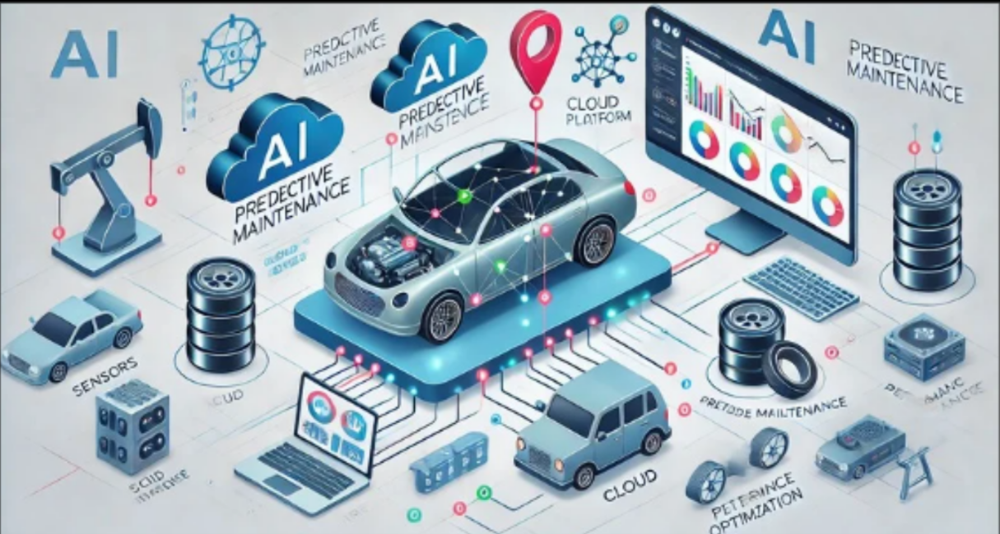

# NeuroDrive: Revolutionizing Vehicle Management with AI & ML 🚗

## Overview
NeuroDrive is an intelligent vehicle management platform that leverages Artificial Intelligence (AI) and Machine Learning (ML) to optimize vehicle health, prevent unexpected breakdowns, and extend the lifespan of batteries and engines. Designed for modern drivers and fleet managers, NeuroDrive offers real-time insights, proactive maintenance, and engaging tools to enhance driving safety and efficiency.

---

## ✨ Key Features

### 1. Predictive Maintenance
- **AI-Powered Insights**: Predicts engine and battery failures, enabling proactive intervention.
- **Real-Time Alerts**: Get notified of potential breakdowns and maintenance needs.
- **Instant Breakdown Solutions**: Offers AI-driven repair tips and DIY videos to reduce downtime.

### 2. Cost Optimization
- **Reduced Breakdown Rate**: Up to **75% fewer unexpected failures**.
- **Savings**: 
  - 2-10% lower fuel costs.  
  - 10-30% more asset availability.  
  - 5-10% reduced maintenance expenses.

### 3. Advanced Trip Planning
- **Route-Specific Weather Forecasts**: Provides time-based weather updates for safer trips.
- **Fuel Efficiency Tracking**: Monitors trip-specific fuel consumption for cost-effective planning.

### 4. Driver Behavior Analysis
- **Real-Time Insights**: Analyzes driving patterns to improve safety and fuel efficiency.
- **Customizable Alerts**: Notifies drivers about risky behaviors and provides actionable suggestions.

### 5. Immersive & Practical Solutions
- **Engaging AR/VR Games**: Enhances the driving experience with educational and entertaining simulations.
- **Real-Time Tips**: Offers practical DIY solutions for quick fixes.

### 6. Tailored Monitoring & Accessibility
- **Customizable Dashboards**: Configure metrics for focused monitoring.
- **Mobile & Web Access**: Monitor vehicle health, trends, and alarms 24/7 on any device.

---

## 🌟 WOW Factor
- **Real-Time Breakdown Solutions**: Get instant AI-powered repair suggestions and practical DIY videos.  
- **Comprehensive Savings**: Minimize costs and maximize efficiency across fuel, maintenance, and uptime.  
- **Innovative Tech Integration**: AR/VR tools and mobile apps elevate the user experience.  

---


---

## 🛠️ Technology Highlights
- **AI & ML Models**: Gradient Boosting Machine (GBM) and Random Forest for accurate predictions.
- **IoT Sensors**: Real-time data collection from vehicle sensors.
- **Data Visualization**: Interactive dashboards built with **Streamlit**.
- **3D & AR Tools**: Browser-based games and augmented simulations powered by **react-three-fiber** and **cannon.js**.
- **Mobile & Web Applications**: Seamless accessibility and user-friendly interfaces.

---

## 🎯 Benefits
- 🚗 **Enhanced Safety**: Prevent breakdowns and ensure passenger safety.
- 🔋 **Optimized Battery Health**: Extend battery life and improve engine efficiency.
- 🕒 **Proactive Maintenance**: Schedule maintenance in advance to minimize downtime.
- 🌍 **Eco-Friendly Driving**: Improve fuel efficiency and reduce environmental impact.
- 📈 **Fleet Productivity**: Increase asset availability and streamline operations.

---

## 🚗 NeuroDrive Applications Across Industries

### Regular Car Users
Real-time vehicle health insights to stay ahead of maintenance and drive with confidence.

### Trucking
Maximize fleet uptime and reduce unscheduled repairs with proactive monitoring.

### Construction
Keep machinery in peak condition, ensuring project timelines are met.

### Mining
Detect early wear and tear in heavy-duty equipment, preventing costly breakdowns.

### Farming
Monitor farming equipment health to avoid delays and boost productivity.

### Oil & Gas
Continuous monitoring of equipment to reduce malfunctions and ensure reliability.

### Transit & Coach
Provide safe, reliable travel with real-time health insights for transit operators.

### Marine Engines
Maximize fuel efficiency and engine reliability, reducing maintenance costs at sea.

### Gensets
Ensure reliable power with continuous performance monitoring for gensets.

### Waste Management
Improve fleet efficiency, reduce downtime, and streamline operations for waste management.

### Logistics
Optimize fleet management, routes, and timely deliveries, ensuring supply chain efficiency.

---

## 🔮 Future Scope
- **IoT Expansion**: Integration with advanced sensors for deeper data insights.
- **Augmented Reality (AR) Diagnostics**: Immersive tools for vehicle maintenance.
- **Global Accessibility**: Multi-language support for diverse user bases.
- **Advanced Driver Monitoring**: AI-based fatigue and distraction detection.

---

## 🚀 Getting Started

### Clone the Repository
```bash
git clone <repository_url>
